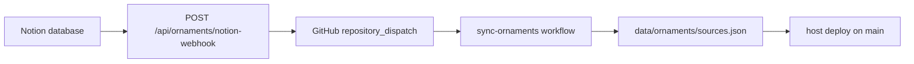

# Daily Notion Ornament Sync

The ornament catalog can sync rows from a Notion database into the local SQLite catalog used by `/ornaments`, export a tracked JSON snapshot, and push that snapshot to GitHub.

## Notion Setup

1. Create a Notion integration at <https://www.notion.so/my-integrations>.
2. Copy the integration secret.
3. Share the Historical Ornaments database with that integration.
4. Copy the actual data source/database ID. Page URLs can point to a page that contains a database; the Historical Ornaments data source ID is `ed3e4557-a0cd-419f-b017-e524d14abff1`.

## Environment

Add these values to `.env.local`:

```bash
NOTION_TOKEN=secret_xxx
NOTION_ORNAMENTS_DATA_SOURCE_ID=ed3e4557-a0cd-419f-b017-e524d14abff1
```

Optional property-name overrides:

```bash
NOTION_ORNAMENT_TITLE_PROPERTY=Name
NOTION_ORNAMENT_CREATOR_PROPERTY=Maker
NOTION_ORNAMENT_YEAR_PROPERTY=Date
NOTION_ORNAMENT_TYPE_PROPERTY=Source
NOTION_ORNAMENT_ERA_PROPERTY=Era
NOTION_ORNAMENT_REGION_PROPERTY=Culture
NOTION_ORNAMENT_URL_PROPERTY=Object
NOTION_ORNAMENT_FILE_PATH_PROPERTY=File Path
NOTION_ORNAMENT_STATUS_PROPERTY=Status
NOTION_ORNAMENT_NOTES_PROPERTY=Notes
```

Missing optional fields fall back to safe values. Each Notion row is stored as a `Source`, deduped by Notion page ID, and uses the Notion page cover as the source image when no file path property is present. The website archive action creates/uses a Notion `Status` select column with `Active` and `Archived` options, and sets archived items to `Archived`; it does not use Notion trash or the built-in page archive flag.

## Commands

Sync Notion rows into the site:

```bash
npm run sync-notion-ornaments
```

Sync Notion rows, export the tracked JSON snapshot, and push that snapshot to GitHub when it changes:

```bash
npm run sync-ornaments-and-push
```

Preview the sync/export step without committing or pushing:

```bash
npm run sync-ornaments-and-push -- --dry-run
```

Write the export without committing (used by GitHub Actions):

```bash
npm run sync-ornaments-and-push -- --no-push
```

## Autonomous sync on Notion changes

Preferred path: Notion webhook → site API → GitHub Action → commit/push `data/ornaments/sources.json`.



### 1. GitHub Actions secrets

In the repo settings → Secrets and variables → Actions, add:

- `NOTION_TOKEN`
- `NOTION_ORNAMENTS_DATA_SOURCE_ID`

The workflow file is [`.github/workflows/sync-ornaments.yml`](../.github/workflows/sync-ornaments.yml). It runs on:

- `repository_dispatch` type `ornament-sync` (from the Notion webhook)
- manual `workflow_dispatch`
- a 20-minute schedule backup

Test the Action manually:

```bash
gh workflow run "Sync ornament sources"
```

### 2. Deploy the webhook endpoint

The webhook URL must be public HTTPS. After deploying this site, it is:

```text
https://YOUR_DOMAIN/api/ornaments/notion-webhook
```

On the host (Vercel or similar), set:

```bash
NOTION_WEBHOOK_SECRET=paste_after_verification
GITHUB_DISPATCH_TOKEN=github_pat_with_repo_scope
GITHUB_REPOSITORY=jmfrnsn/portfolio-jun-2026
```

`GITHUB_DISPATCH_TOKEN` needs permission to create a `repository_dispatch` on this repo (classic PAT `repo` scope, or fine-grained PAT with Actions write).

### 3. Create the Notion webhook subscription

1. Open your Notion integration → **Webhooks** → **Create a subscription**.
2. URL: `https://YOUR_DOMAIN/api/ornaments/notion-webhook`
3. Subscribe at least to:
   - `page.created`
   - `page.properties_updated`
   - `page.content_updated`
   - `page.deleted`
   - `page.undeleted`
4. Create the subscription. Notion POSTs `{ "verification_token": "..." }` once.
5. Copy that token from the API response or host logs, paste it into Notion to verify the subscription, then set the same value as `NOTION_WEBHOOK_SECRET` on the host.
6. Add a row or edit a property in Historical Ornaments and confirm:
   - the webhook route returns `{ "ok": true, "dispatched": true }`
   - the GitHub Action `Sync ornament sources` runs
   - `data/ornaments/sources.json` updates when content changed

## macOS Daily Schedule (optional backup)

The local LaunchAgent is optional once the webhook + Action path is live. Keep it if you want a laptop-side backup.

Create `~/Library/LaunchAgents/com.jade.ornament-agent.plist`:

```xml
<?xml version="1.0" encoding="UTF-8"?>
<!DOCTYPE plist PUBLIC "-//Apple//DTD PLIST 1.0//EN"
  "http://www.apple.com/DTDs/PropertyList-1.0.dtd">
<plist version="1.0">
<dict>
  <key>Label</key>
  <string>com.jade.ornament-agent</string>

  <key>WorkingDirectory</key>
  <string>/Users/jadef/portfolio-jun-2026</string>

  <key>ProgramArguments</key>
  <array>
    <string>/usr/bin/env</string>
    <string>npm</string>
    <string>run</string>
    <string>sync-ornaments-and-push</string>
  </array>

  <key>StartCalendarInterval</key>
  <dict>
    <key>Hour</key>
    <integer>8</integer>
    <key>Minute</key>
    <integer>0</integer>
  </dict>

  <key>StandardOutPath</key>
  <string>/Users/jadef/portfolio-jun-2026/data/ornament-agent.log</string>
  <key>StandardErrorPath</key>
  <string>/Users/jadef/portfolio-jun-2026/data/ornament-agent.err.log</string>
</dict>
</plist>
```

Load it:

```bash
launchctl bootstrap gui/$(id -u) ~/Library/LaunchAgents/com.jade.ornament-agent.plist
```

Unload it:

```bash
launchctl bootout gui/$(id -u)/com.jade.ornament-agent
```
